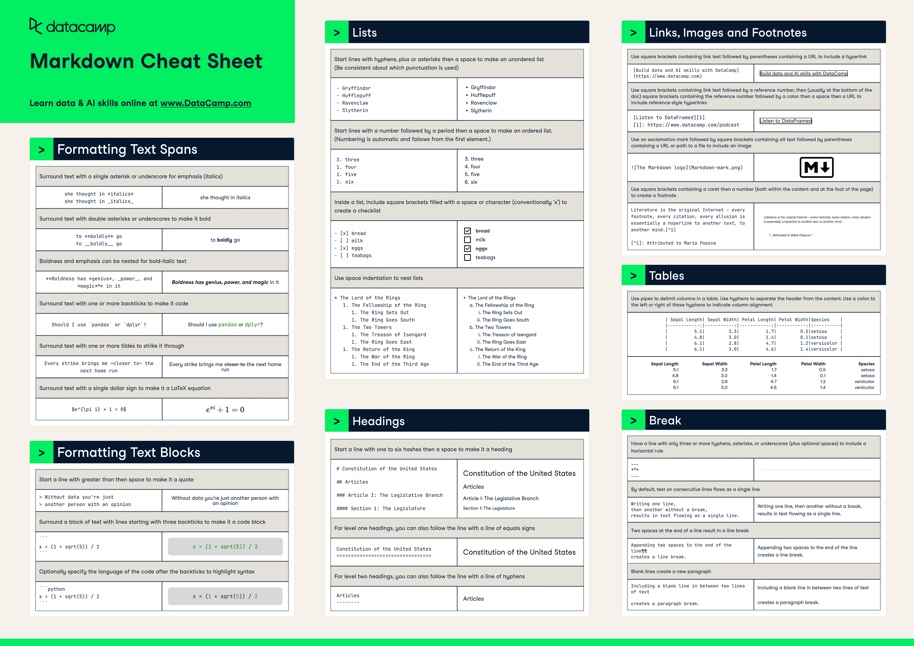
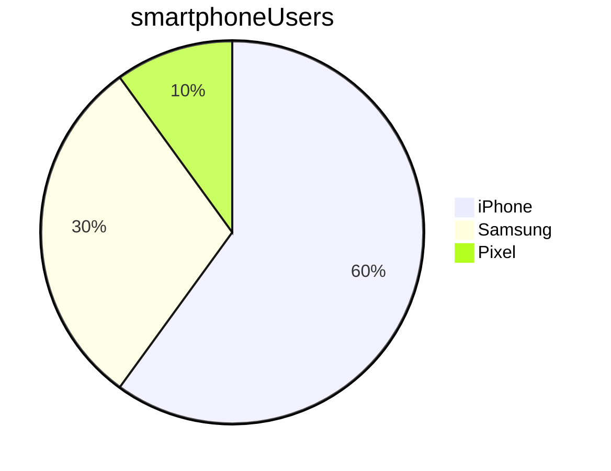

Table of contents

* [Lists](#Lists)

<br>

# This is a h1 header

## This is a h2 header

### and so on...

This is plain text

*Italics*

_Also italics_

**Bold**

__Also bold__

_This is a mix of **bold** and italics_

> This is a quote
>> By this person

# Lists

* item 1
* item 2
  * sub item 1
  * sub item 2

Numbered lists

1. item 1
2. item 2



[Google](https://google.com)

# Marking as code

This is how you print hello in python: `print('hello')`

```python
print('hello')
print('hello')
```

## Task list

* [ ] list item not ticked
* [x] list item ticked

## Tables

Name|   Street   |  Town
--------|------------|----------
Cathy   | Main St    | Birmingham
John    | Maple Drive  | Stafford



Some maths is $\frac{1}{2}$

$$e^\pi$$

I made a change

and another one